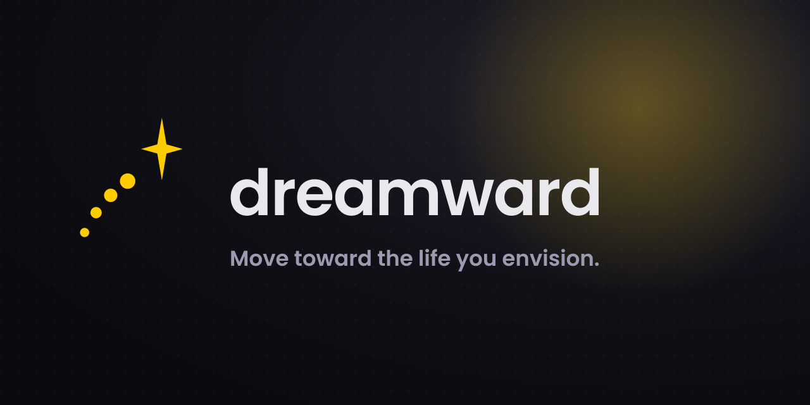

<p align="center">
  
</p>

# Dreamward

**[dreamward.life](https://dreamward.life)** · move toward the life you envision.

**Dreamward** — a private app for turning the life you envision into the life you live: a book of your 12 life areas, goals with measurable progress, granular actions, a journal, visual moodboards, and AI agents (built-in and external) that work over your own content. Bilingual (English + Hebrew, full RTL), dark + gold REALIZEOS design language.

> **Status:** v0.4.0 — "meaning & focus". Runs as a **desktop app** (Windows / macOS / Linux) for one person, or **self-hosted** for you and a small invited circle.

## Highlights

- **Your Dreamward, structured** — cover, life vision Q&A, per-category vision / purpose / strategy / goals sections, implementation pages.
- **Meaning & focus** — a **Current Life Chapter** (focus vs. maintenance areas, a *not now* list, an anti-vision), a per-category **identity** layer and **life wheel** ("how close is today to my vision", with history), and a guided, interactive **IKIGAI** wizard with a live four-circle diagram.
- **Goals & progress** — goals with status history, plus computed progress rollups: % of linked actions completed, weekly momentum, and *stalled / at-risk* signals surfaced on the dashboard.
- **Actions** — granular next steps below goals: priority, due dates, links to any dreamward entity, provenance (who created it — you, Lify, or an external agent), soft delete.
- **Journal** — rich-text entries with full-text search (FTS5).
- **Visual moodboards** — Konva-based collage editor with image upload, templates and snapshots.
- **Lify (חיימי) — your AI companion** — a warm, motivating, emotionally-aware guide over your own Dreamward. Provider-agnostic (OpenRouter, OpenAI-compatible APIs, local Ollama / Lemonade, experimental ChatGPT/Codex sign-in). Streams chat, reads your content through tools, and proposes changes you approve.
- **Autonomous routines** — scheduled Lify runs: a daily plan (with optional auto-applied action proposals), weekly-review prep, and goal-drift detection.
- **Agent access (MCP + CLI + REST)** — connect any external AI agent (Claude Code, Codex, Hermes, any MCP client) with personal API keys: an MCP server (tools, resources and Lify's rituals as prompts), a `dreamward` CLI with one-command agent setup, and a bearer-authenticated `/api/v1` surface — every agent mutation lands in an audit trail with prior-state capture.
- **Calendar feed** — subscribe to your due actions and dated goals from Google/Apple/Outlook Calendar (read-only ICS).
- **True multi-user isolation** — every account gets its **own SQLite database and asset directory** (`data/users/<uid>/`). No shared content tables, no cross-tenant queries by construction.
- **Admin dashboard** — invite links, enable/disable/delete users, per-user storage & AI token usage, audit log.
- **Privacy-first** — self-hosted, cookie sessions (httpOnly, Secure, SameSite=strict), argon2id passwords, AES-256-GCM-encrypted provider keys, hashed API keys, nightly backups.

## Architecture (short version)

```
Browser ── HTTPS ──> Traefik (Coolify) ──> web (nginx: SPA + /api,/media proxy) ──> api (Fastify)
AI agents ─ MCP/CLI ─ Bearer lbk_… ──────────────────────► /api/v1 ─┘                 │
                                                              data volume:  control.db (accounts, invites,
                                                                            audit, AI usage, API keys)
                                                                            users/<uid>/lifebook.db + assets/
```

- **API**: Fastify 5 + better-sqlite3 + Drizzle ORM. Per-request tenant context via AsyncLocalStorage — feature code is tenant-blind.
- **Web**: React 19 + Vite + TanStack Query + Tailwind (REALIZEOS design system).
- **Agents**: `@dreamward/mcp` (stdio MCP server) and `dreamward` call `/api/v1` over HTTPS with scoped API keys.
- **Deploy**: Docker Compose; images on GHCR; GitHub Actions deploys every release.

Full details: [docs/architecture.md](docs/architecture.md).

## Desktop app

Download the installer for Windows, macOS or Linux from the
[latest release](https://github.com/SufZen/Dreamward/releases/latest) — no
server, no account, your book stays on your computer (automatic backups and
updates). Guide: [docs/desktop.md](docs/desktop.md).

## Self-host it (2 minutes)

```bash
curl -fsSL https://dreamward.life/install.sh | sudo bash
```

Asks for a domain (automatic HTTPS) or runs on your home network, generates
secrets, and prints a one-time link to create your admin account. Upgrades are
backup-protected and roll back automatically if anything goes wrong
(`dreamward-ctl update`). Full guide: [docs/self-hosting.md](docs/self-hosting.md).

## Quick start (local dev)

```bash
# prerequisites: Node 22+, pnpm 10
cp .env.example .env          # set JWT_SECRET at minimum
pnpm install
pnpm dev                      # api on :4000, web on :5173 (proxied)
```

First boot prints a one-time setup link (`http://localhost:5173/setup?token=…`) to create the admin account — or set `DREAMWARD_EMAIL` / `DREAMWARD_PASSWORD` in `.env` to create it automatically. Add more users from **Admin → Invite links**.

### Connect an AI agent (2 minutes)

1. In the app: **Settings → AI agent access → Create key** (pick *Read & write*).
2. Log the CLI in and let it configure your agent:
   ```bash
   pnpm --filter dreamward build
   node packages/cli/dist/index.js login --url https://your-dreamward --key lbk_…
   node packages/cli/dist/index.js setup claude-desktop --write   # or claude-code, cursor, vscode, gemini, codex, opencode…
   ```
3. Ask your agent to *"run the weekly review"* — the MCP server gives it 37 tools, your book as resources, and Lify's rituals as prompts, on **your own AI subscription**.

Full guide (every harness, n8n/OpenAPI, Hermes/OpenClaw, calendar feed): [docs/agent-access.md](docs/agent-access.md).

## Documentation

| Doc | What's inside |
| --- | --- |
| [docs/architecture.md](docs/architecture.md) | System design, multi-user isolation model, data layout, agent surface |
| [docs/agent-access.md](docs/agent-access.md) | API keys, MCP server, CLI, autonomous routines, calendar feed, audit |
| [docs/self-hosting.md](docs/self-hosting.md) | Install, update, back up and run your own instance |
| [docs/releasing.md](docs/releasing.md) | Versioning, release pipeline, rollback, data-safety rules |
| [docs/deployment.md](docs/deployment.md) | VPS deployment (Coolify/Traefik), CI/CD, rollback |
| [docs/admin-guide.md](docs/admin-guide.md) | Invites, user lifecycle, usage monitoring, audit log |
| [docs/user-guide.md](docs/user-guide.md) | Using the Dreamward, goals, actions, journal, moodboards, AI chat |
| [docs/ai-providers.md](docs/ai-providers.md) | Connecting OpenRouter / local models / ChatGPT (Codex) |
| [docs/security-privacy.md](docs/security-privacy.md) | Threat model, what's encrypted, data ownership |
| [docs/backup-restore.md](docs/backup-restore.md) | Backup layout, retention, full restore procedure |
| [docs/roadmap-2.0.md](docs/roadmap-2.0.md) | Dreamward 2.0 analysis — what ships, what waits, what's missing |
| [docs/PRD.md](docs/PRD.md) | Original product requirements |
| [CHANGELOG.md](CHANGELOG.md) | Release history |
| [CONTRIBUTING.md](CONTRIBUTING.md) | Repo layout, scripts, conventions |

## Repository layout

```
apps/api          Fastify API (auth, control plane, features, AI engine, agent API)
apps/web          React SPA
packages/shared   Zod API contract + constants shared by api/web
packages/client   Typed HTTP client for /api/v1 (used by mcp + cli)
packages/mcp      MCP server — tools, resources and ritual prompts for external AI agents
packages/cli      `dreamward` command-line client
packages/design-system  REALIZEOS components + Tailwind preset
scripts/deploy    VPS bootstrap
.github/workflows CI + release/deploy pipelines
```

## License

[AGPL-3.0-only](LICENSE). You may use, study, modify and self-host it freely;
if you run a modified version as a service for others, you must share your
changes under the same license. Contributions: see [CONTRIBUTING.md](CONTRIBUTING.md).
